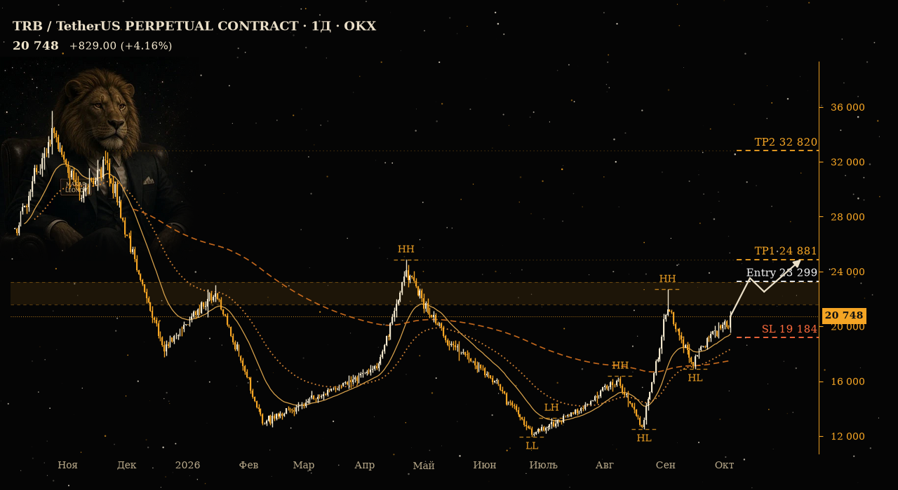

# Crypto SignalBot

Telegram-бот, который сканирует USDT-перпетуалы Binance / Bybit / OKX по **открытым** данным
(без API-ключей, ничего не торгует) и публикует в ваш канал идеи на пробой уровня: график в стиле
TradingView + короткая подпись.



## Как это работает
1. **Вселенная** — перпетуалы USDT с объёмом за 24ч выше порога; дубли по монете убираются, приоритет у
   биржи, стоящей раньше в `exchanges`.
2. **Уровни** — swing-максимумы/минимумы кластеризуются по ATR; берётся ближайшая зона сопротивления
   (LONG) или поддержки (SHORT), в которой цена или рядом с ней.
3. **Цели** — ближайшие 1–2 пула ликвидности (equal highs/lows, старые экстремумы) за зоной.
4. **Скоринг 0–100** — близость к зоне, сжатие волатильности (Bollinger width), рост объёма,
   higher lows / lower highs, число касаний, R/R. Лучшие кандидаты дополнительно корректируются на ±10 пунктов
   по открытому контексту рынка (`signalbot/enrich.py`): funding и динамика открытого интереса монеты (OKX),
   тренд BTC (цена vs EMA50 и 7д), индекс Fear & Greed (alternative.me). Недоступный источник = нейтрально. Публикуются лучшие идеи не ниже `min_score`
   и не больше `max_ideas_per_day`.
5. **Пост** — картинка в тёмном «звёздном» стиле (янтарные/кремовые свечи, EMA 21/50/200, метки структуры HH/HL/LH/LL,
   зона пробоя, уровни Entry / SL / TP1 / TP2, стрелка-сценарий, плашка цены, талисман слева) + подпись по шаблону.
6. **Трекинг** — каждые 15 минут бот проверяет идеи и отвечает на исходный пост:
   «пробой произошёл ✅», «цель N взята 🎯», «все цели 🏆», «стоп ❌», «идея отменена ❌».
7. **Статистика** — SQLite, команда `/stats`, итоги недели в канал по понедельникам.

Правила сделки (одинаковы в боте и бэктесте, `signalbot/lifecycle.py`):
пробой = закрытие дневной свечи за зоной; вход по цене этого закрытия; стоп = инвалидация за зоной;
позиция делится поровну между целями; в одной свече стоп приоритетнее цели.

## Быстрый старт
1. Создайте бота у [@BotFather](https://t.me/BotFather) (`/newbot`), скопируйте токен.
2. Создайте канал (или возьмите свой), **Администраторы → Добавить → ваш бот**, право «Публикация сообщений».
3. Узнайте свой `OWNER_ID` (например, через @userinfobot) — это chat id для режима DRY_RUN и команд.
4. `cp .env.example .env` и заполните `BOT_TOKEN`, `OWNER_ID`, `CHANNEL_ID` (`@имя` или `-100…`).
5. Напишите своему боту `/start`, иначе он не сможет писать вам в личку.
6. Запуск:
   ```bash
   pip install -r requirements.txt
   python -m signalbot.main
   ```
   По умолчанию `DRY_RUN=true`: все посты приходят **только вам в личку**. Когда внешний вид
   устроит — поставьте `DRY_RUN=false`, и посты пойдут в канал.

## Команды (только владелец)
`/start` · `/stats` · `/active` (идеи в работе) · `/scan` (скан прямо сейчас)

## Настройка
Все пороги в `config.yaml` (объём, расстояние до зоны, `min_rr`, `min_score`, лимиты, расписание).
Талисман: `chart.mascot_image` (по умолчанию `assets/mascot.png`, `null` — выключить). Маленький логотип слева внизу: `chart.watermark_image`.
Для 4h-идей: `timeframe: 4h`.

## Бэктест
```bash
python -m signalbot.backtest --exchange binance --months 12 --top 30
python -m signalbot.backtest --synthetic --months 12 --top 12   # без сети, только проверка механики
```
Выводит число идей, винрейт, средний результат в R, суммарный результат и максимальную просадку.
Допущения: дневные свечи, без комиссий и проскальзывания. **Прогоните его на реальных данных
и оцените результат, прежде чем публиковать идеи подписчикам.**

## Запуск через GitHub Actions (без своего сервера)
GitHub сам запускает бота каждые 30 минут (`.github/workflows/signalbot.yml`). Что делает каждый запуск:
проверяет открытые идеи и шлёт апдейты, раз в 4 часа сканирует рынок, по понедельникам в 09:00 UTC
публикует итоги недели. База (SQLite) хранится в ветке `bot-state` этого же репозитория.

1. Репозиторий → **Settings → Secrets and variables → Actions → New repository secret**. Создайте три секрета:
   `BOT_TOKEN`, `CHANNEL_ID`, `OWNER_ID`.
2. Там же вкладка **Variables → New repository variable**: `DRY_RUN` = `true` (посты только вам в личку).
3. Вкладка **Actions** → слева `signalbot` → **Run workflow** → режим `scan`. Через пару минут посты придут в личку.
4. Всё устраивает — поменяйте переменную `DRY_RUN` на `false`. Дальше посты идут в канал сами.

Режимы ручного запуска: `auto` (как по расписанию), `scan`, `track`, `report`, `preview` (2 примера постов только вам в личку, без базы и лимитов — удобно подгонять внешний вид), `getid`
(показывает id канала: опубликуйте пост в канале и запустите `getid`; id смотрите в логе запуска).
Команды `/scan` и `/stats` в этом режиме не работают: бот не висит постоянно.

Ограничения: расписание GitHub бывает неточным (опоздание на минуты); в публичных репозиториях
расписание отключается после 60 дней без коммитов; в приватном репозитории лимит 2000 бесплатных минут
в месяц (бот укладывается примерно в 1500); часть бирж (Binance, Bybit) может блокировать IP американских
серверов GitHub — тогда бот автоматически работает с теми биржами, что отвечают (обычно OKX).

## Деплой (постоянный процесс)
**Docker / VPS**
```bash
docker compose up -d --build
docker compose logs -f
```
`restart: unless-stopped` перезапускает контейнер при падении; `./data` хранит SQLite.

**Render** — подключите репозиторий как Blueprint (`render.yaml`, тип Worker). Задайте
`BOT_TOKEN`, `CHANNEL_ID`, `OWNER_ID`. Диск (`/app/data`) нужен для сохранности статистики и
доступен на платных планах.

## Тесты
```bash
pytest -q
```
Покрыто: определение уровней, скоринг, жизненный цикл идей, подписи, рендер графика (smoke),
SQLite, статистика, пагинация бирж (на моках), бэктест, сквозной сценарий скан → пост → апдейты.

## Структура
```
signalbot/
  exchanges.py  ccxt: Binance/Bybit/OKX, вселенная, свечи с пагинацией
  levels.py     swing-точки, кластеры, зона, пулы ликвидности
  scoring.py    скоринг идеи
  scanner.py    анализ одной монеты -> Idea
  chart.py      график в стиле TradingView
  caption.py    подписи и тексты апдейтов
  lifecycle.py  WATCH -> BROKEN -> TP_ALL | STOPPED, CANCELLED/EXPIRED
  storage.py    SQLite
  service.py    скан, публикация, трекинг, отчёты
  bot.py        команды aiogram
  backtest.py   бэктест
  main.py       APScheduler + polling
```

## Важно
Бот публикует идеи, а не гарантии. В ряде стран публичные торговые рекомендации регулируются —
проверьте требования своей юрисдикции. Строка-дисклеймер под постом выключена по умолчанию;
включается через `caption.disclaimer: true`.
